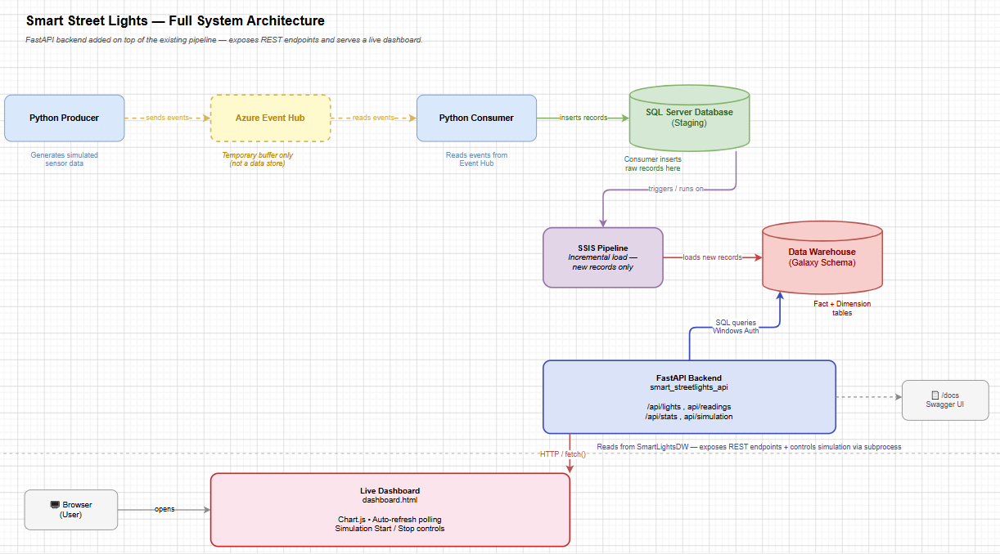

# 🚦 Smart Street Lights — Data Pipeline

An end-to-end data engineering pipeline that simulates IoT sensor data from smart street lights, streams it through Azure Event Hub, stages it in SQL Server, and loads it incrementally into a Data Warehouse (Galaxy Schema) using SSIS.

> Event Hub acts as a **temporary buffer** between the Producer and Consumer — it is **not** a final data store.

---

## 📐 Architecture



| Stage | Component | Role |
|---|---|---|
| 1 | **Python Producer** | Generates simulated sensor data and sends it as events |
| 2 | **Azure Event Hub** | Temporary streaming buffer (not persistent storage) |
| 3 | **Python Consumer** | Reads events from Event Hub and inserts raw records into staging |
| 4 | **SQL Server (Staging)** | Stores raw, unprocessed sensor records |
| 5 | **SSIS Pipeline** | Performs incremental load — moves only new records |
| 6 | **Data Warehouse (Galaxy Schema)** | Final destination — Fact + Dimension tables for analytics |

**Legend:**
- `- - -` Streaming (temporary buffer)
- `───` Persistent storage / ETL flow

---

## 🛠️ Tech Stack

- **Python** — data simulation (Producer) & event consumption (Consumer)
- **Azure Event Hub** (`Slight-eventhub`) — real-time event streaming
- **SQL Server** — staging database & data warehouse
- **SSIS (SQL Server Integration Services)** — ETL / incremental load
- **draw.io** — architecture diagram (Chen Notation)

---

## 📁 Project Structure

```
smart-street-lights-pipeline/
│
├── smart_lights_data/
│   ├── producer.py            # Generates & sends simulated sensor data to Event Hub
│   ├── consumer.py            # Reads events from Event Hub, inserts into staging DB
│   └── generated_data.py      # Simulated sensor data generation logic
│
├── sql/
│   ├── SmartLightsDB.sql      # Staging database schema (SmartLightsDB)
│   └── SmartLightsDW.sql      # Data Warehouse schema (SmartLightsDW - Fact + Dimension tables)
│
├── ssis/
│   ├── Load_DB.dtsx           # SSIS package - loads raw events into staging (SmartLightsDB)
│   └── Load_DW.dtsx           # SSIS package - incremental load into warehouse (SmartLightsDW)
│
├── docs/
│   └── architecture.png       # Architecture diagram
│
├── requirements.txt           # Python dependencies
├── .env.example                # Environment variable template
└── README.md
```

---

## ⚙️ Setup & Installation

### 1. Clone the repository
```bash
git clone https://github.com/sandydraz/smart-street-lights-pipeline.git
cd smart-street-lights-pipeline
```

### 2. Install Python dependencies
```bash
pip install -r requirements.txt
```

### 3. Configure environment variables
Create a `.env` file based on `.env.example`, using your `Slight-eventhub` connection details:
```env
EVENT_HUB_CONNECTION_STR=<your-event-hub-connection-string>
EVENT_HUB_NAME=Slight-eventhub
SQL_SERVER=<your-sql-server-address>
SQL_DATABASE=SmartLightsDB
SQL_USERNAME=<your-username>
SQL_PASSWORD=<your-password>
```

### 4. Set up the SQL Server staging database
Run the schema script in SQL Server Management Studio (SSMS):
```bash
sql/SmartLightsDB.sql
```

### 5. Set up the Data Warehouse
```bash
sql/SmartLightsDW.sql
```

---

## ▶️ Running the Pipeline

**Step 1 — Generate simulated data:**
```bash
python smart_lights_data/generated_data.py
```

**Step 2 — Start the Producer** (sends simulated data to Event Hub):
```bash
python smart_lights_data/producer.py
```

**Step 3 — Start the Consumer** (reads from Event Hub, writes to staging):
```bash
python smart_lights_data/consumer.py
```

**Step 4 — Run the SSIS packages** to load data into the warehouse:
- Open `ssis/Load_DB.dtsx` in Visual Studio (SSDT) — loads/validates raw records into `SmartLightsDB` staging
- Open `ssis/Load_DW.dtsx` — performs the incremental load into `SmartLightsDW`
- Execute manually, or schedule via SQL Server Agent for automated runs

---

## 🔄 Data Flow Summary

```
Python Producer → Azure Event Hub (Slight-eventhub) → Python Consumer → SmartLightsDB (Staging) → SSIS (Load_DB → Load_DW) → SmartLightsDW (Galaxy Schema)
```

1. The **Producer** simulates sensor readings (e.g., light status, brightness, energy usage) and pushes them as events to `Slight-eventhub`.
2. **Event Hub** temporarily buffers these events for consumption.
3. The **Consumer** reads the events and inserts raw rows into the **SmartLightsDB** staging database.
4. **Load_DB.dtsx** validates/stages the records, then **Load_DW.dtsx** performs an incremental load — only new records since the last run — into **SmartLightsDW**.
5. The Data Warehouse organizes data into **Fact** and **Dimension** tables (Galaxy Schema), ready for reporting and analysis.

---

## 📌 Notes

- The staging database (`SmartLightsDB`) holds raw, unprocessed data — intentionally separate from the warehouse to keep ingestion and analytics layers decoupled.
- The SSIS pipeline uses an incremental load strategy, so only newly inserted records are processed on each run, avoiding duplicates.

---

## 📄 License

This project is for educational purposes as part of a data engineering coursework/portfolio project.
